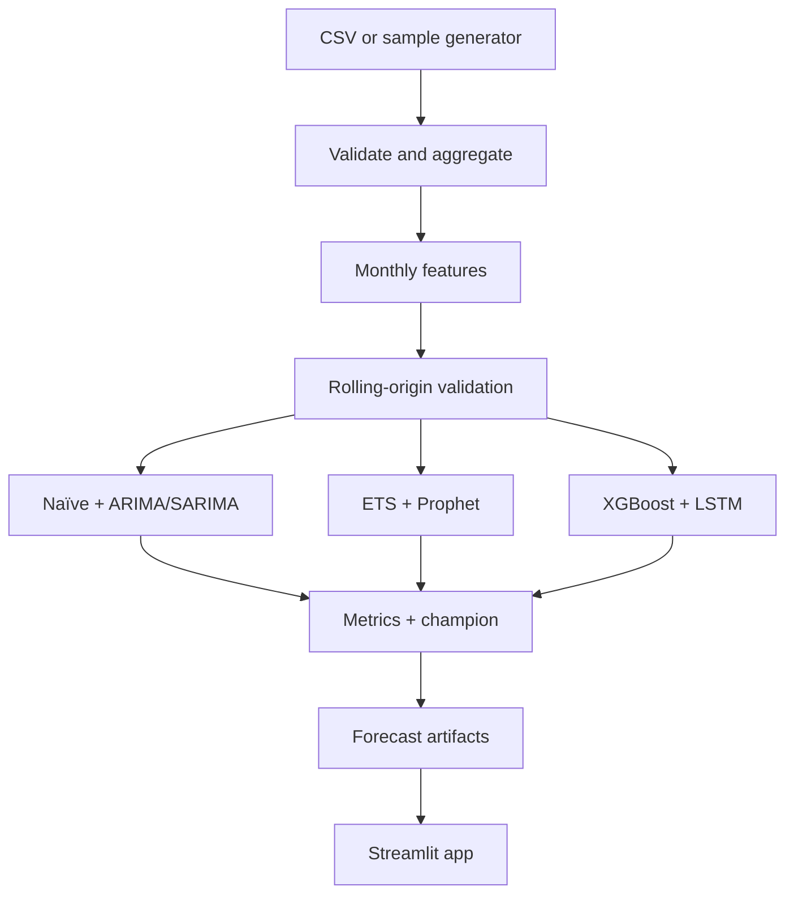

# Book Publisher Trends (7 Models)

An end-to-end, three-day data science portfolio project that forecasts monthly
book publication volume. It includes ingestion, validation, EDA-ready data,
leakage-safe time-series features, rolling-origin validation, seven models,
hyperparameter tuning, experiment artifacts, tests, and a Streamlit app.

## Business question

**How many titles will be published in each of the next 12 months?** A publisher
can use the answer to plan editorial capacity, marketing calendars, and printing.
The target is `titles_published`; optional `genre` values support filtered EDA.

## Architecture



## Quick start in VS Code

```bash
python -m venv .venv
# Windows: .venv\Scripts\activate
source .venv/bin/activate
pip install -e ".[models,dev,app]"
python -m book_trends.pipeline --generate-sample --tune
streamlit run app.py
```

For a fast smoke run without heavy model dependencies:

```bash
pip install -e ".[dev]"
python -m book_trends.pipeline --generate-sample --models seasonal_naive
pytest
```

Artifacts are written to `artifacts/`: `history.csv`, `genre_monthly.csv`, EDA
summaries, `metrics.csv`, `backtest_predictions.csv`, `residual_summary.csv`,
`all_model_forecasts.csv`, the champion-only `forecast.csv`, `tuning_results.csv`
(with `--tune`), and `run_metadata.json`. The Streamlit app reads only this folder.
It shows EDA (trend, seasonality, and genre mix), the leaderboard, an interactive
explanation of lags, rolling means, and expanding windows, and one tab per model
with backtests, residual diagnostics, and a 12-month forecast with an 80% band.

## Use real data

Provide a CSV with either monthly rows or individual books. Required columns:

- `publication_date`: parseable date
- `title_id`: book identifier (individual-book input), **or**
- `titles_published`: already aggregated monthly count
- `genre`: optional

```bash
python -m book_trends.pipeline --input data/raw/books.csv --horizon 12
```

The included sample data is synthetic and must be labeled as such in a portfolio.
A strong extension is to export Open Library or Kaggle catalog data into this
schema and document its license and coverage limitations.

## Validation design

Random train/test splits are invalid for forecasting. This project uses expanding
windows: each fold trains only on the past and predicts a future block. XGBoost
features use lagged target values (1, 2, 3, 6, 12 months), rolling means shifted
by one month, trend, and calendar seasonality. The final holdout is never used
for tuning: XGBoost
is tuned on two folds that end before the first backtest month.

Forecast bands use the same method for every model. Each band is the forecast ±
the 80th percentile of that model's absolute backtest error, so a model's band
width shows how well it backtested. This approximation ignores how error grows
with horizon.

The model suite includes seasonal naïve, ARIMA, SARIMA, Holt-Winters ETS,
Prophet, XGBoost, and LSTM. ARIMA provides a non-seasonal classical benchmark; SARIMA
models annual autocorrelation explicitly; ETS captures evolving level, trend,
and seasonality. Prophet offers structural components, while XGBoost learns
nonlinear relationships from lagged features.

The Keras LSTM uses the JAX CPU backend, a 12-month normalized input sequence,
32 memory units, 10% dropout, Adam optimization, early stopping, and recursive forecasting. Deep learning is
included as a challenger, not assumed to be superior: 120 monthly observations
is a small dataset for a neural network, so the simpler baselines remain essential.

Metrics: MAE and RMSE measure absolute error; MAPE is intuitive but unstable near
zero; sMAPE is the main comparison metric. The champion is the lowest mean sMAPE.

### Verified synthetic-sample result

The full seven-model run completed with three rolling-origin folds:

| Model | Mean MAE | Mean RMSE | Mean MAPE | Mean sMAPE |
|---|---:|---:|---:|---:|
| Prophet | 6.763 | 8.024 | 1.428% | 1.436% |
| SARIMA | 8.064 | 9.219 | 1.733% | 1.728% |
| ETS | 8.511 | 10.138 | 1.814% | 1.835% |
| XGBoost | 15.988 | 19.775 | 3.373% | 3.422% |
| Seasonal naïve | 18.611 | 22.316 | 3.983% | 4.109% |
| LSTM | 33.060 | 37.073 | 7.226% | 7.027% |
| ARIMA | 71.589 | 79.303 | 15.701% | 14.630% |

Prophet remains champion for this deterministic synthetic sample. LSTM performance
varied substantially across folds (sMAPE 8.880%, 1.743%, and 10.460%), illustrating
why neural networks need adequate data and must be compared with strong simple
baselines. XGBoost tuning selected `max_depth=5`, `learning_rate=0.08`, and
`n_estimators=400`. Residual diagnostics show seasonal naïve under-forecasts 78%
of validation months because it cannot follow the upward trend. Prophet's errors
are balanced at 50%. One SARIMA fold produced an optimizer convergence warning;
inspect convergence and residual diagnostics before production use. These results
demonstrate the workflow and do not describe the real book market.

## Three-day plan

| Day | Outcome | Portfolio evidence |
|---|---|---|
| 1 | Ingest, validate, aggregate, EDA | schema checks, trend/seasonality plots, data caveats |
| 2 | Backtest 7 models and tune XGBoost | leakage-safe folds, metrics table, residual analysis |
| 3 | Final forecast, tests, app, README | Streamlit demo, Dockerfile, reproducible commands |

## Suggested portfolio narrative

1. State the planning problem and forecast horizon.
2. Explain dataset provenance, missing months, and synthetic-vs-real limitations.
3. Show trend, annual seasonality, genre mix, and outliers.
4. Justify chronological validation and the seasonal-naïve benchmark.
5. Compare fold-level metrics, not only one test split.
6. Discuss why the winner wins and where errors cluster.
7. End with deployment, monitoring, and retraining recommendations.

## Repository map

```text
src/book_trends/     ingestion, features, models, validation, pipeline
tests/               unit and smoke tests
app.py               Streamlit dashboard
data/                ignored generated/raw data
artifacts/           ignored model outputs
.github/workflows/   CI
```

## Deployment

The app needs precomputed artifacts, and `artifacts/` is gitignored. For
Streamlit Community Cloud, run the pipeline, commit `artifacts/` (for example with
`git add -f artifacts`), choose `app.py`, and use Python 3.11. To build locally
instead (the image installs only the app dependencies):

```bash
make docker            # runs the pipeline, then docker build
docker run -p 8501:8501 book-publisher-trends-7-models
```

## Honest limitations

- Publication dates can reflect editions rather than unique works.
- Catalog coverage changes over time and can create artificial trends.
- Counts do not measure sales or demand.
- Major shocks and publisher-specific events need external regressors.
- Native intervals from different model families are not directly comparable,
  so the app uses empirical backtest-error bands instead. These bands are wider
  than their stated coverage for short horizons and narrower for long ones.
